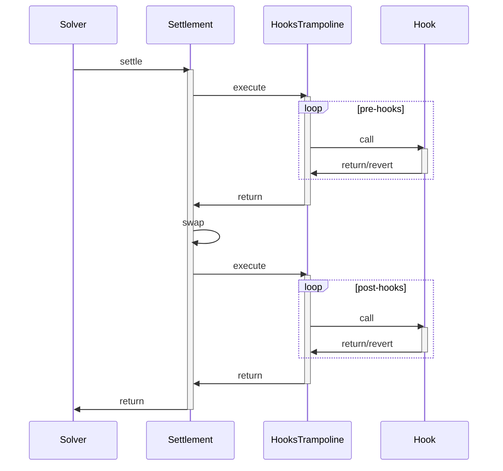

# Hooks Trampoline

Hooks are a CoW Protocol feature that allow traders to specify custom Ethereum
calls as part of their order to get executed atomically in the same transaction
as they trade.

The `HooksTrampoline` contract protects the protocol from two things:

- Executing calls from the privileged context of the settlement contract. Fees
  are accrued in the contract, and users could simply specify hooks that
  `ERC20.transfer(user, amount)` if the calling context for user hooks were the
  settlement contract.
- Reverting unnecessary hooks during a settlement. This can cause a two issues:
  - `Interaction`s from the settlement contract are called with all remaining
    `gasleft()`. This means, that a revert from an `INVALID` opcode for example,
    would consume 63/64ths of the total transaction gas. This means that hooks
    can make settlements extremely expensive for nothing.
  - Other orders being executed as part of the settlement would also not be
    included.

As such, the `HooksTrampoline` contract is designed to execute user-specified
hooks:

1. From an unprivileged context (the `HooksTrampoline` contract instead of the
   CoW Protocol settlement contract).
2. Specify a gas limit, to cap `INVALID` opcodes from consuming too much gas.
3. Allow the calls to revert.

In addition, the `HooksTrampoline` also only allows calls from the settlement
contract. This means that hook implementations can add checks that ensure that
they are only called from within a settlement:

```solidity
require(msg.sender == HOOKS_TRAMPOLINE_ADDRESS, "not a settlement");
```

## Settlement Diagram


