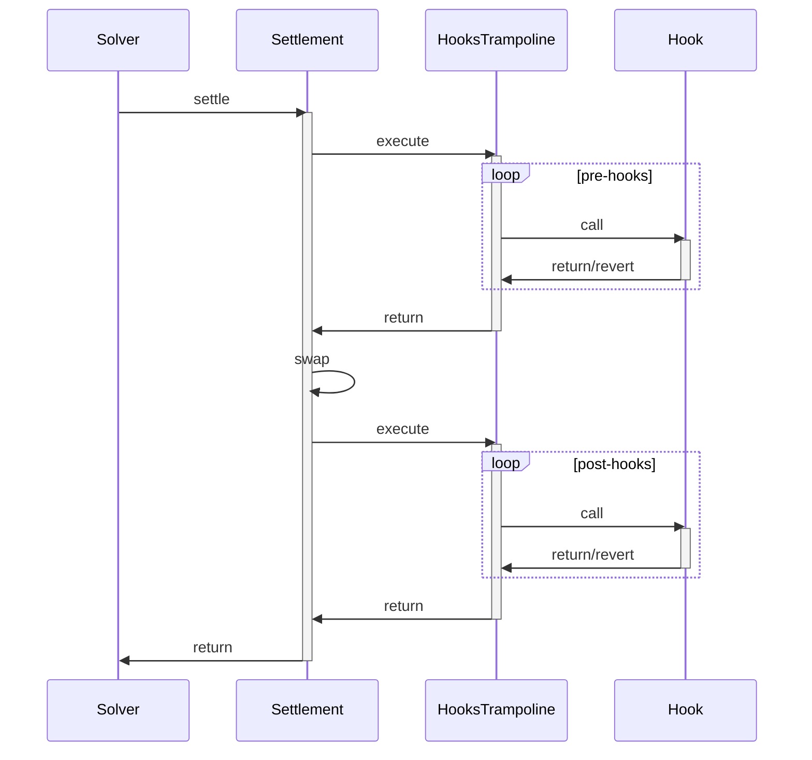

# Hooks Trampoline

Hooks are a CoW Protocol feature that allow traders to specify custom Ethereum
calls as part of their order to get executed atomically in the same transaction
as they trade.

The `HooksTrampoline` contract protects the protocol from two things:

- Executing calls from the privileged context of the settlement contract. Fees
  are accrued in the contract, and users could simply specify hooks that
  `ERC20.transfer(user, amount)` if the calling context for user hooks were the
  settlement contract.
- Reverting unnecessary hooks during a settlement. This can cause a two issues:
  - `Interaction`s from the settlement contract are called with all remaining
    `gasleft()`. This means, that a revert from an `INVALID` opcode for example,
    would consume 63/64ths of the total transaction gas. This means that hooks
    can make settlements extremely expensive for nothing.
  - Other orders being executed as part of the settlement would also not be
    included.

As such, the `HooksTrampoline` contract is designed to execute user-specified
hooks:

1. From an unprivileged context (the `HooksTrampoline` contract instead of the
   CoW Protocol settlement contract).
2. Specify a gas limit, to cap `INVALID` opcodes from consuming too much gas.
3. Allow the calls to revert.

In addition, the `HooksTrampoline` also only allows calls from the settlement
contract. This means that hook implementations can add checks that ensure that
they are only called from within a settlement:

```solidity
require(msg.sender == HOOKS_TRAMPOLINE_ADDRESS, "not a settlement");
```

## Settlement Diagram


```mermaid
sequenceDiagram
    participant Solver
    participant Settlement
    participant HooksTrampoline
    participant Hook

    Solver->>Settlement: settle
    activate Settlement

    Settlement->>HooksTrampoline: execute
    activate HooksTrampoline
    loop pre-hooks
        HooksTrampoline->>Hook: call
        activate Hook

        Hook->>HooksTrampoline: return/revert
        deactivate Hook
    end
    HooksTrampoline->>Settlement: return
    deactivate HooksTrampoline

    Settlement->>Settlement: swap

    Settlement->>HooksTrampoline: execute
    activate HooksTrampoline
    loop post-hooks
        HooksTrampoline->>Hook: call
        activate Hook

        Hook->>HooksTrampoline: return/revert
        deactivate Hook
    end
    HooksTrampoline->>Settlement: return
    deactivate HooksTrampoline


    Settlement->>Solver: return
    deactivate Settlement
```

## Development

### Installation

This project uses [Foundry](https://book.getfoundry.sh/).

Additional dependencies can be installed with:

```sh
forge install
```

### Test

```sh
forge test
```

## Building a Cannon Package for Deployment

This project uses [Cannon](https://usecannon.com/) to generate a deployable artifact for the contracts in this repository. The deployment on live networks does not occur on this repository.

To learn more or browse artifacts for the actual deployed contracts, see [`cowprotocol/deployments` repository](https://github.com/cowprotocol/deployments) or [`cow-omnibus` on Cannon Explorer](https://usecannon.com/packages/cow-omnibus).

### Building the Cannon Package

To build a new Cannon package:

```sh
yarn build:cannon
```

This will:
- Recompile the Solidity contracts as needed
- Generate a deployment manifest including the solidity input json, default settings, ABIs, as well as predicted deployment addresses.

### Publishing the Cannon Package

When the contracts should be released to staging or production:

1. Double check that the `version` field in `cannonfile.toml` is as expected, and modify as necessary.

2. Follow instructions in [Building the Cannon Package](#Building the Cannon Package) above to ensure the artifacts are up to date.

3. Publish the cannon package using an EOA that has permission on the `cow-settlement` package. You will also need 0.0025 ETH + gas on Optimism Mainnet.

To publish, execute the publish command:

```
yarn cannon:publish
```

Where `<version>` is the version recorded in the `cannonfile.toml` from earlier, and `13370` is the anvil network created by cannon and used to prepare the packages before publishing. 

You will be prompted for the publishing network (select "Optimism") and for the private key of the account to use to publish.

4. Ensure that you have changes for git in your `cannon/` directory. If not, you may need to run the `cannon:record` command:

```
yarn cannon:record 
```

5. Bump the patch version of the package as specified in `cannonfile.toml`. This version should be bumped *after* the publish is complete.

Commit all the changes to a PR. A CI job will ensure consistency between the published package and repository files.

