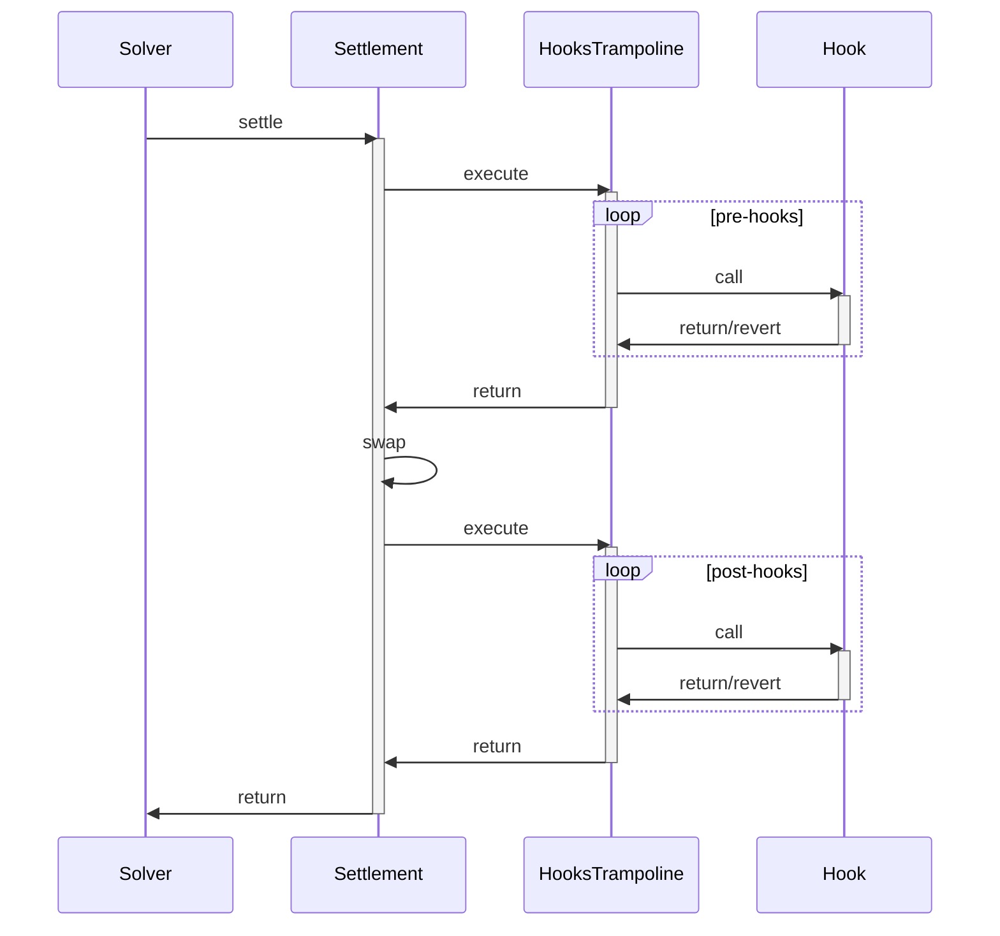

# Hooks Trampoline

Hooks are a CoW Protocol feature that allow traders to specify custom Ethereum
calls as part of their order to get executed atomically in the same transaction
as they trade.

The `HooksTrampoline` contract protects the protocol from two things:

- Executing calls from the privileged context of the settlement contract. Fees
  are accrued in the contract, and users could simply specify hooks that
  `ERC20.transfer(user, amount)` if the calling context for user hooks were the
  settlement contract.
- Reverting unnecessary hooks during a settlement. This can cause a two issues:
  - `Interaction`s from the settlement contract are called with all remaining
    `gasleft()`. This means, that a revert from an `INVALID` opcode for example,
    would consume 63/64ths of the total transaction gas. This means that hooks
    can make settlements extremely expensive for nothing.
  - Other orders being executed as part of the settlement would also not be
    included.

As such, the `HooksTrampoline` contract is designed to execute user-specified
hooks:

1. From an unprivileged context (the `HooksTrampoline` contract instead of the
   CoW Protocol settlement contract).
2. Specify a gas limit, to cap `INVALID` opcodes from consuming too much gas.
3. Allow the calls to revert.

In addition, the `HooksTrampoline` also only allows calls from the settlement
contract. This means that hook implementations can add checks that ensure that
they are only called from within a settlement:

```solidity
require(msg.sender == HOOKS_TRAMPOLINE_ADDRESS, "not a settlement");
```

## Settlement Diagram


```mermaid
sequenceDiagram
    participant Solver
    participant Settlement
    participant HooksTrampoline
    participant Hook

    Solver->>Settlement: settle
    activate Settlement

    Settlement->>HooksTrampoline: execute
    activate HooksTrampoline
    loop pre-hooks
        HooksTrampoline->>Hook: call
        activate Hook

        Hook->>HooksTrampoline: return/revert
        deactivate Hook
    end
    HooksTrampoline->>Settlement: return
    deactivate HooksTrampoline

    Settlement->>Settlement: swap

    Settlement->>HooksTrampoline: execute
    activate HooksTrampoline
    loop post-hooks
        HooksTrampoline->>Hook: call
        activate Hook

        Hook->>HooksTrampoline: return/revert
        deactivate Hook
    end
    HooksTrampoline->>Settlement: return
    deactivate HooksTrampoline


    Settlement->>Solver: return
    deactivate Settlement
```

## Development

### Installation

This project uses [Foundry](https://book.getfoundry.sh/).

Additional dependencies can be installed with:

```sh
forge install
```

### Test

```sh
forge test
```

### Deployment

This project uses [Cannon](https://usecannon.com/) to generate a deployable artifact for the contracts in this repository. The deployment on live networks does not occur on this repository.

To learn more or browse artifacts for the actual deployed contracts, see [`cowprotocol/deployments` repository](https://github.com/cowprotocol/deployments) or [`cow-omnibus` on Cannon Explorer](https://usecannon.com/packages/cow-omnibus).

As a backup, the artifacts for this repository's contracts are committed to `cannon/` through a generated command.

Before creating the deployment package, it is necessary to install cannon through `pnpm`:

```
pnpm install
```

#### Building the Cannon Package

To build a new Cannon package for Hooks Trampoline:

```sh
pnpm cannon build
```

This will:
- Recompile the Solidity contracts as needed with Foundry
- Generate a deployment manifest including the solidity input json, default settings, ABIs, as well as predicted deployment addresses.

### Building with Custom Settings

To build with custom create2 salt or settlement contract address, you can pass variables:

```sh
pnpm cannon build cowSettlement=0xYourOwnerAddress salt='Mattresses in Tokyo!'
```

### Publishing the Cannon Package

Upon release, the cannon package for this repository should be published, and the deployment artifacts should be recorded on this repository.

To publish the cannon package, using a wallet that has permission to publish on behalf of the `cow-settlement` package on the Cannon Registry, execute the publish command:

```
pnpm cannon publish cow-settlement:<version> --chain-id 13370
```

To record the release artifacts to this repository, run:

```
pnpm record-cannon
```
